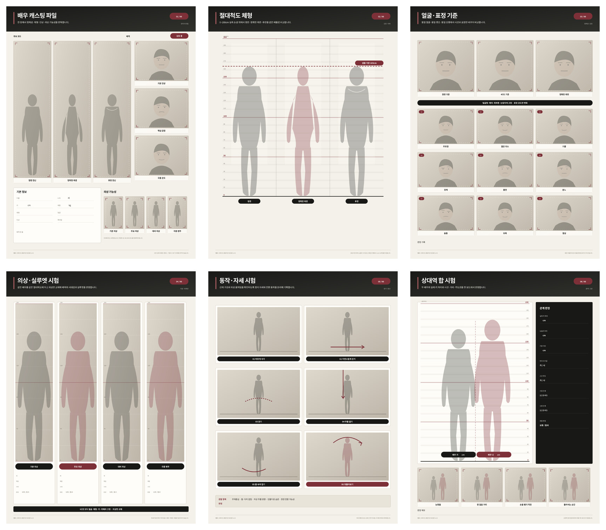
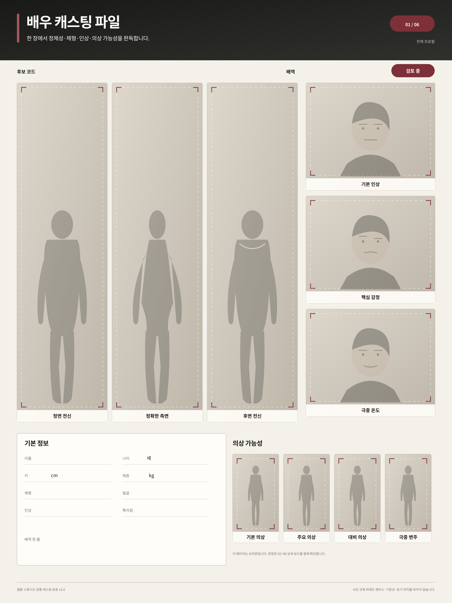
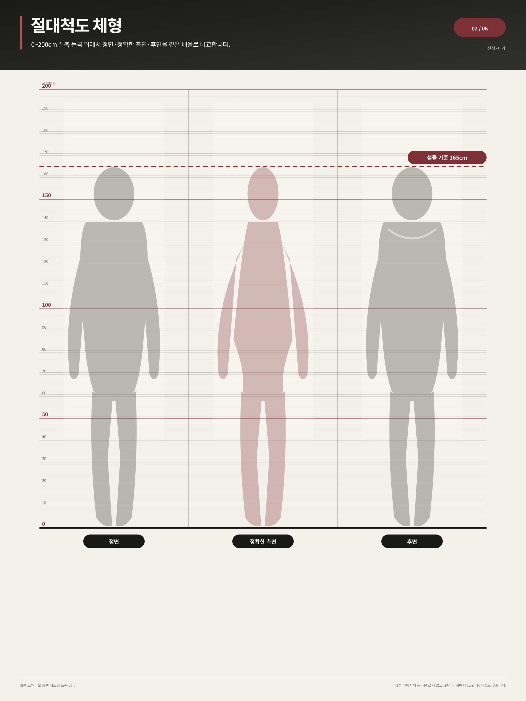
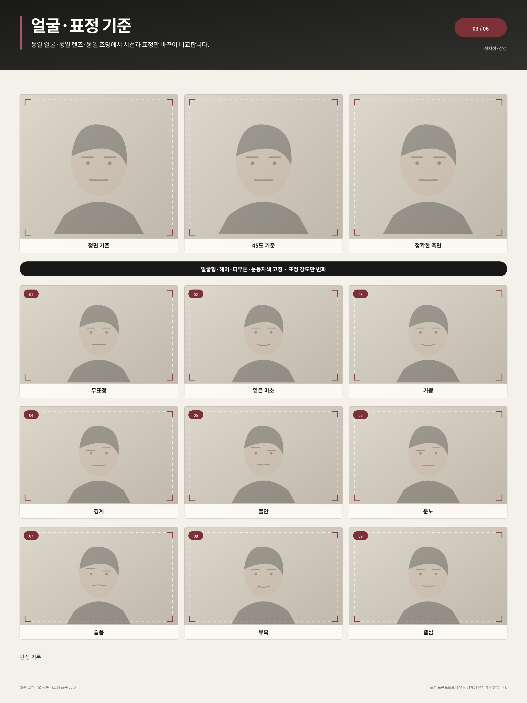
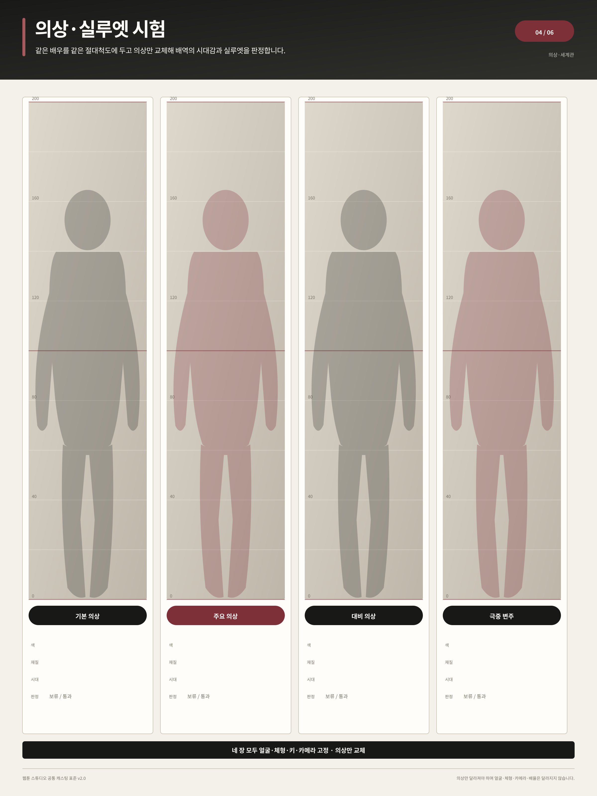
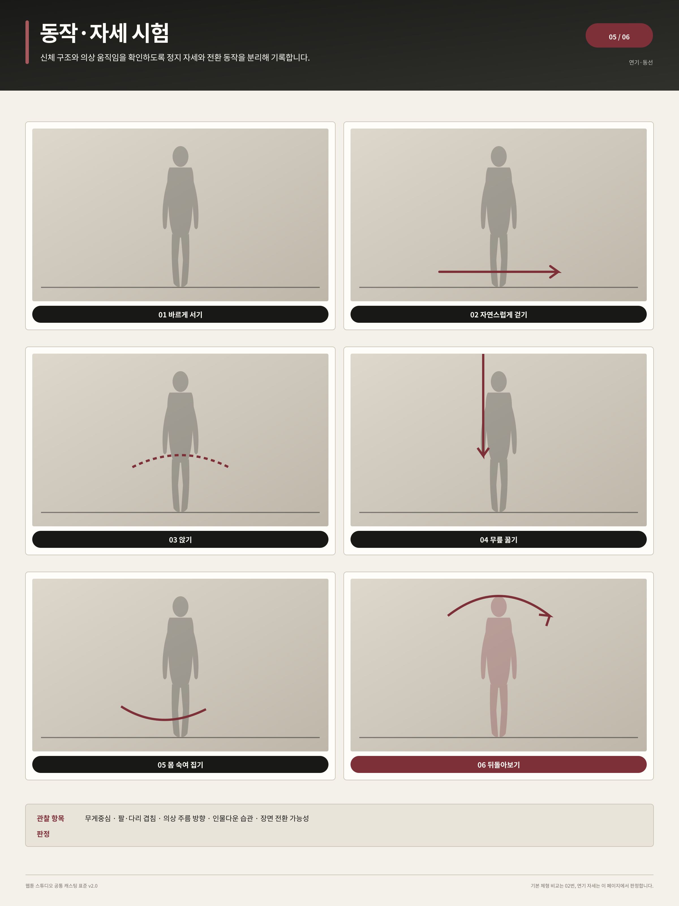

# 공통 배우 캐스팅 파일 v2

[← 캐스팅 템플릿](README.md) · [공통 절대규격](../../../CASTING-STANDARD.md)

배우 한 명마다 아래 6장을 같은 순서로 만든다. 사진을 누르면 2400 × 3200픽셀 원본이 열린다.

## 01 · 전체 프로필

[SVG 편집 원본](casting-dossier-v2-01-overview.svg)

## 02 · 절대척도 체형

[SVG 편집 원본](casting-dossier-v2-02-body-scale.svg)

## 03 · 얼굴·표정 기준

[SVG 편집 원본](casting-dossier-v2-03-face-expression.svg)

## 04 · 의상·실루엣 시험

[SVG 편집 원본](casting-dossier-v2-04-costume.svg)

## 05 · 동작·자세 시험

[SVG 편집 원본](casting-dossier-v2-05-movement.svg)

## 06 · 상대역 합 시험

[SVG 편집 원본](casting-dossier-v2-06-chemistry.svg)

[← 캐스팅 템플릿](README.md) · [공통 절대규격](../../../CASTING-STANDARD.md)
