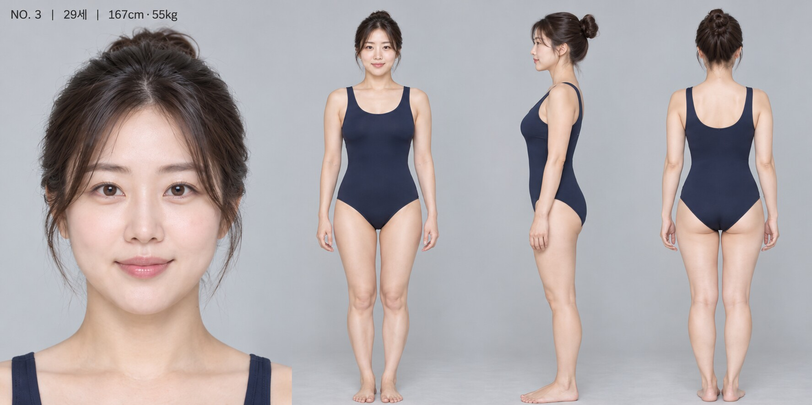

[← 월급날 이후](README.md)

# 월급날 이후 — 주인공 캐스팅

> 현재 등록된 후보 전원입니다. 배우마다 사진 한 장으로 비교하며, 사진을 누르면 원본 크기로 열립니다.

## OFFICE-01 · 한서윤

**29세 · 168센티미터 · 55킬로그램 · 건강하게 단련된 배우 체형 · 검토 중**

[한서윤 한 장 크게 보기 →](characters/candidates/OFFICE-01/README.md)

---

## BODY-01

**29세 · 168센티미터 · 55킬로그램 · 체중을 유지한 자연스러운 탄력 체형 · 검토 중**

[BODY-01 한 장 크게 보기 →](characters/candidates/BODY-01/README.md)

---

## NO-03

**29세 · 167센티미터 · 55킬로그램 · 부드러운 인상을 유지한 탄력 체형 · 검토 중**

[NO-03 한 장 크게 보기 →](characters/candidates/NO-03/README.md)

---

[← 월급날 이후](README.md)
