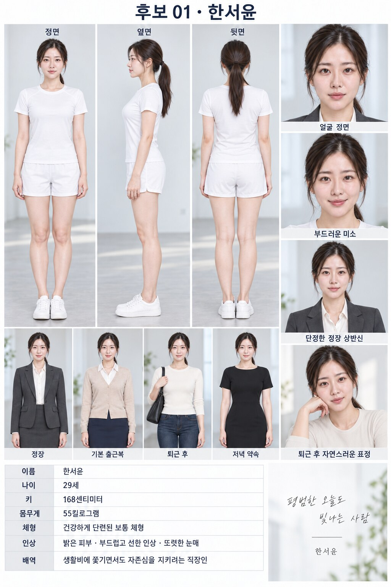
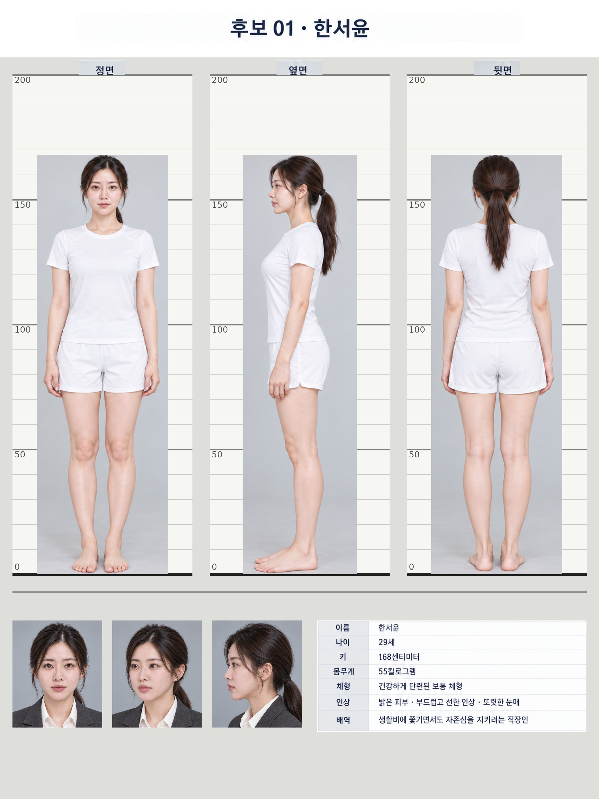
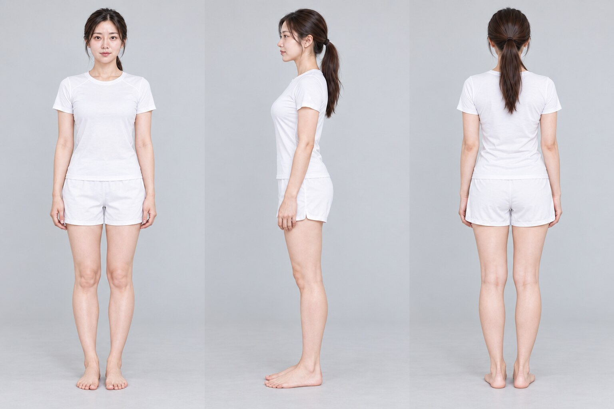
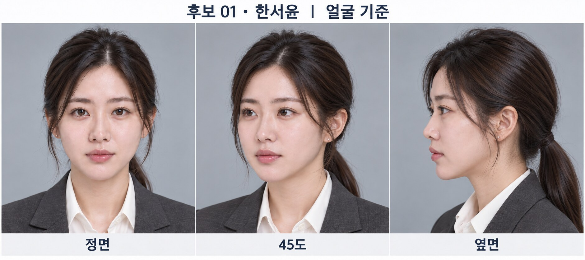
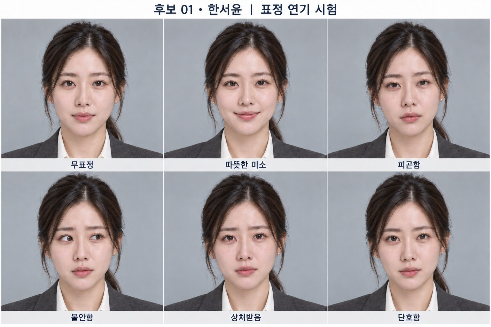
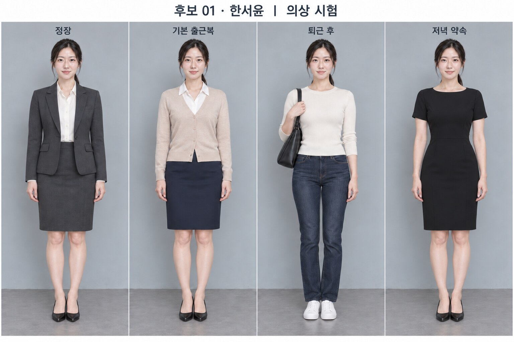
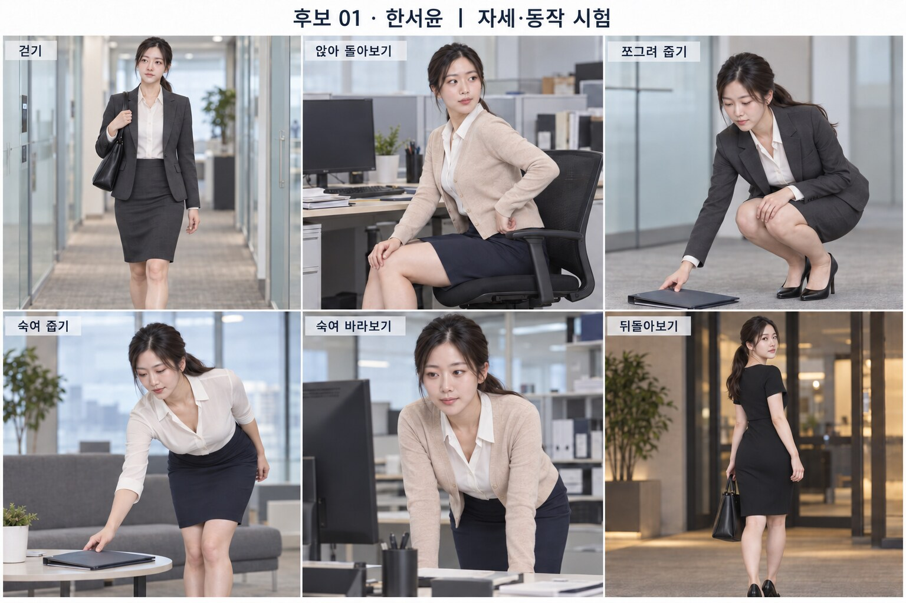

[← 월급날 이후 캐스팅](../../../CASTING.md)

# 후보 01 · 한서윤

**29세 · 168센티미터 · 55킬로그램 · 검토 중**

사진을 누르면 원본 크기로 열립니다.

## 대표 프로필

## 1. 체형·키 전신 시험

168센티미터를 1680화소로 맞춘 공통 절대척도입니다.

### 정면·옆면·뒷면 원본

## 2. 얼굴 기준과 표정 연기

## 3. 의상 룩북

## 4. 자세·동작 시험

## 남은 시험

상대 배우 호흡 시험은 상대 후보가 정해진 뒤 같은 절대척도로 제작합니다.

---

[← 월급날 이후 캐스팅](../../../CASTING.md)
