[← 누군가의 봄](../README.md)

# EP.09 더 깊어지는 관계

[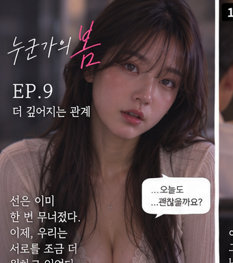](https://raw.githubusercontent.com/freepass-creator/webtoon-studio/main/webtoons/someone-spring/ep09/scene-00-title.png)

[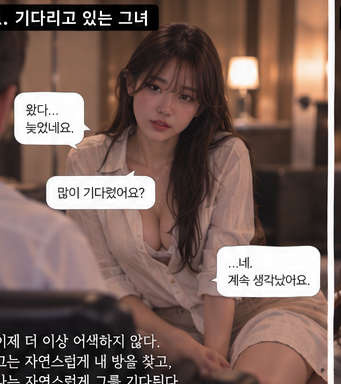](https://raw.githubusercontent.com/freepass-creator/webtoon-studio/main/webtoons/someone-spring/ep09/scene-01.png)

[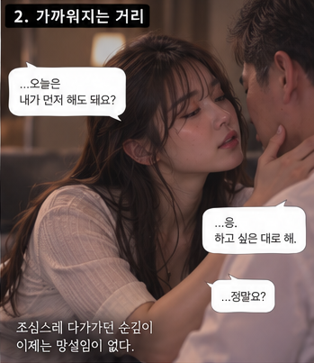](https://raw.githubusercontent.com/freepass-creator/webtoon-studio/main/webtoons/someone-spring/ep09/scene-02.png)

[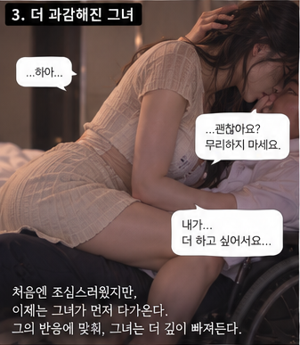](https://raw.githubusercontent.com/freepass-creator/webtoon-studio/main/webtoons/someone-spring/ep09/scene-03.png)

[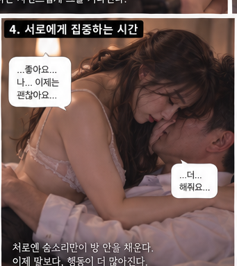](https://raw.githubusercontent.com/freepass-creator/webtoon-studio/main/webtoons/someone-spring/ep09/scene-04.png)

[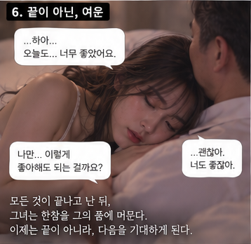](https://raw.githubusercontent.com/freepass-creator/webtoon-studio/main/webtoons/someone-spring/ep09/scene-06.png)

[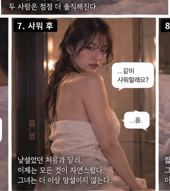](https://raw.githubusercontent.com/freepass-creator/webtoon-studio/main/webtoons/someone-spring/ep09/scene-07.png)

[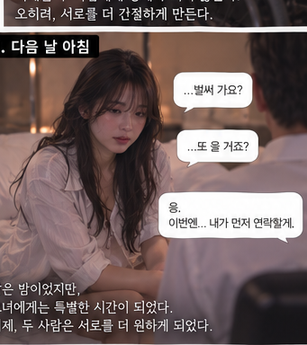](https://raw.githubusercontent.com/freepass-creator/webtoon-studio/main/webtoons/someone-spring/ep09/scene-08.png)

[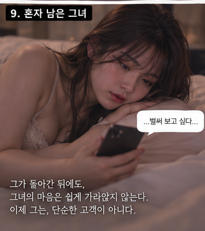](https://raw.githubusercontent.com/freepass-creator/webtoon-studio/main/webtoons/someone-spring/ep09/scene-09.png)

[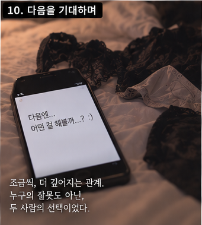](https://raw.githubusercontent.com/freepass-creator/webtoon-studio/main/webtoons/someone-spring/ep09/scene-10.png)

[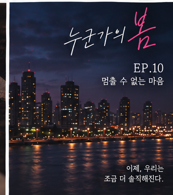](https://raw.githubusercontent.com/freepass-creator/webtoon-studio/main/webtoons/someone-spring/ep09/scene-11-end.png)

---

[← EP.08 조금씩, 선이 흐려진다](../ep08/README.md) · [누군가의 봄 목록](../README.md)
